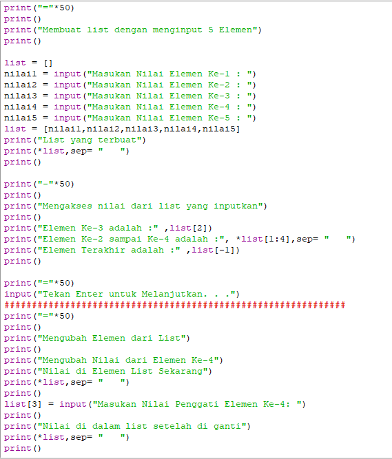
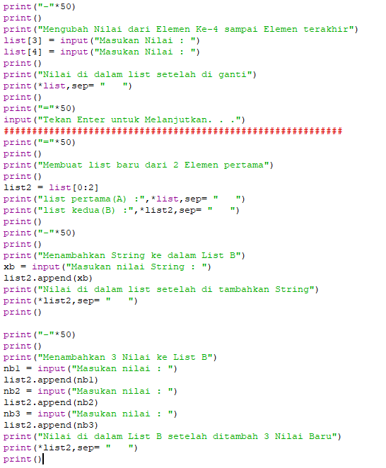
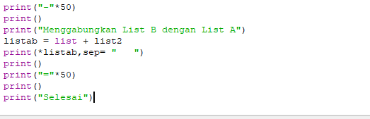
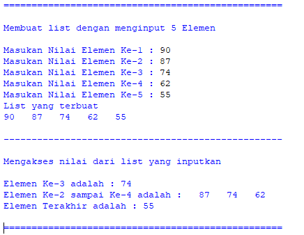
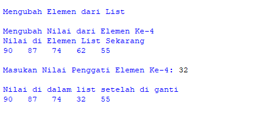
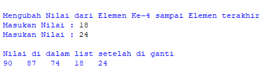
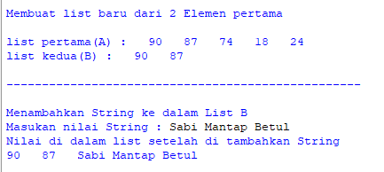
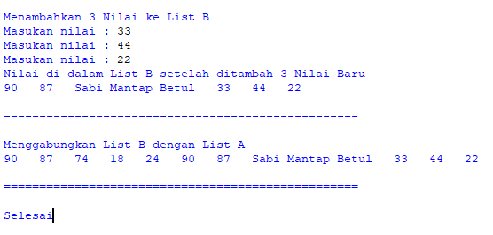

# Latihan9
## Materi List,Tuple,dan Dictionary

Ini Adalah Codingannya\

Membuat List dengan memasukan 5 Nilai\
Nilai yang di input adalah 90, 87, 74 , 62, dan 55\
Menampilkan listnya\
Mengakses nilai list seperti disoal.\

Mengubah elemen ke-4 dari list dan menampilkannya\
Dengan input 32.\

Mengubah elemen ke-4 sampai elemen terakhir\
Dengan input 18 dan 24\

Membuat list dengan 2 elemen dari list pertama\
Dan menampilkannya\
Menabahkan nilai baru kedalam List Kedua(B) dengan nilai String\
Dengan input "Sabi Mantap Betul"\

Menambakan 3 Nilai baru kedalam list kedua(B)\
Dengan input 33, 44, dan 22\

